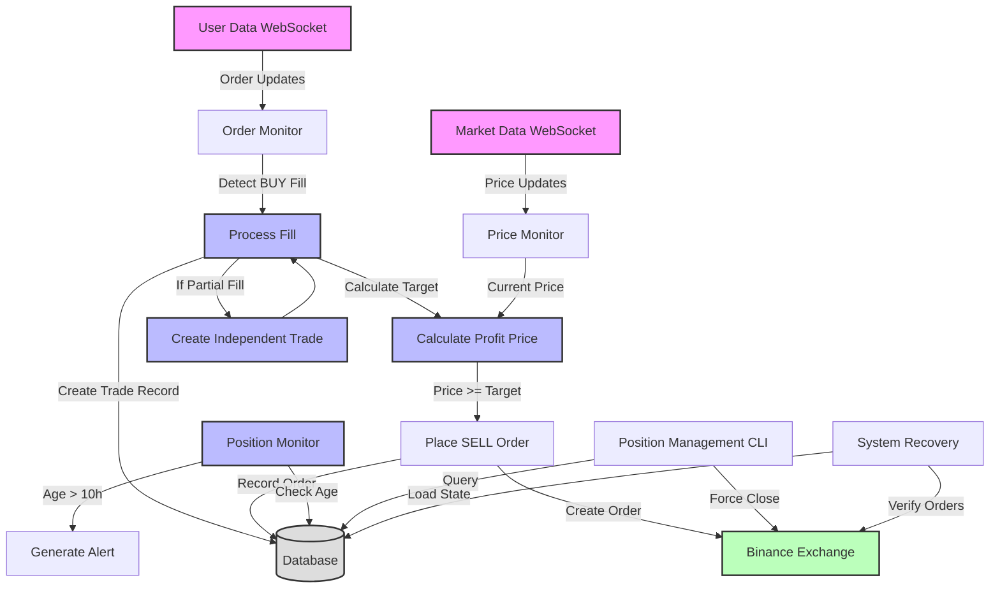

# Binance Swing Trading Automation - Production Design

## Overview

A Python-based automation system for swing trading on Binance, focusing on managing SELL orders for existing BUY positions. The system monitors filled BUY orders and places corresponding SELL orders when profit conditions are met. Once a SELL order is placed, it remains active until either filled or manually cancelled - the system maintains a strict hands-off approach to active SELL orders.

### System Workflow



### Key Features
- Monitor and manage BUY orders with exact 1:1 quantity matching for SELL orders
- Handle partial BUY fills as independent trades, each with its own SELL order
- Calculate and place SELL orders with 0.3% net profit (after 0.1% buy + 0.1% sell fees)
- Real-time order status monitoring via user data WebSocket (with REST API fallback)
- Real-time price monitoring via market data WebSocket (with REST API fallback)
- Persistent state management with SQLite
- Comprehensive logging system with rotation (100MB files, 5 backups)
- True indefinite position holding - SELL orders remain active until filled
- No automatic liquidation or cancellation under any circumstances
- Manual position management through separate command-line utility
- Automatic system state recovery after restart

### Position Lifecycle
1. BUY Order Detection:
   - Monitor user data stream for BUY order updates
   - Each filled quantity (partial or full) treated as independent trade
   - No aggregation or splitting of quantities allowed

2. SELL Order Placement:
   - Place SELL order only after BUY fill confirmation
   - Exact same quantity as the filled BUY portion
   - Price calculated to ensure 0.3% net profit after all fees

3. Position Monitoring:
   - SELL orders remain active indefinitely
   - No automatic cancellation or modification
   - Position age tracking and alerts (default 10 hours)
   - Manual intervention required for any SELL order changes

4. System Shutdown/Restart:
   - Active SELL orders remain on exchange
   - System state preserved in SQLite
   - Restart recovers and continues monitoring

## 1. Directory Structure

```
binance_swing_trading/
├── src/
│   ├── __init__.py
│   ├── config/
│   │   ├── __init__.py
│   │   ├── settings.py          # App settings, constants, env loading
│   │   └── logging_config.py    # Logging configuration
│   ├── core/
│   │   ├── __init__.py
│   │   ├── price_manager.py     # Price updates (WebSocket + REST fallback)
│   │   ├── order_manager.py     # Order operations
│   │   ├── profit_calculator.py # Profit calculations with fees
│   │   └── state_manager.py     # System state management
│   ├── db/
│   │   ├── __init__.py
│   │   ├── models.py           # SQLite table definitions
│   │   └── operations.py       # DB operations
│   └── utils/
│       ├── __init__.py
│       └── helpers.py          # Utility functions
├── tools/
│   └── manage_positions.py     # CLI utility for manual position management
├── tests/
│   ├── __init__.py
│   ├── test_db_operations.py    # Database operations tests
│   ├── test_price_manager.py
│   ├── test_order_manager.py
│   ├── test_profit_calculator.py
│   └── test_state_manager.py
├── docs/                       # Documentation directory
│   ├── user_guide/            # Installation and usage instructions
│   ├── api/                   # Internal API reference
│   └── deployment/            # Production deployment guides
├── data/
│   ├── trading.db             # SQLite database
│   └── logs/
│       ├── trading.log        # Main rotating log file
│       └── error.log          # Separate error log stream
├── .env.example               # Template for environment variables
├── requirements.txt           # Project dependencies
├── setup.py                   # Package installation config
├── main.py                    # Entry point
└── README.md                 # Project documentation
```

### 1.1 Package Setup
```bash
# Install in development mode
pip install -e .

# Project structure as Python package
swing_trading_automat/
├── setup.py              # Package installation configuration
├── pyproject.toml       # Build system requirements
└── src/                 # Source code as installable package
    └── swing_trading_automat/
        ├── __init__.py
        └── [module directories...]
```

### 1.2 Dependencies
Required Python packages:
```
# API Client
python-binance>=1.0.19    # Binance API interactions

# Database
SQLAlchemy>=2.0.0        # Database ORM

# WebSocket (both required)
websockets>=12.0         # Async WebSocket client for market data
websocket-client>=1.7.0  # WebSocket client for user data stream

# Environment & Configuration
python-dotenv>=1.0.0     # Environment variable management

# Logging
structlog>=24.1.0        # Structured logging

# Testing & Quality
pytest>=8.0.0           # Testing framework
pytest-asyncio>=0.23.0  # Async test support
pytest-mock>=3.12.0     # Mocking support
pytest-cov>=4.1.0       # Coverage reporting
mypy>=1.8.0            # Type checking
black>=24.1.0          # Code formatting
isort>=5.13.0          # Import sorting
flake8>=7.0.0          # Code linting

# Performance Testing
psutil>=5.9.6          # System resource monitoring
memory-profiler>=0.61.0 # Memory profiling
```

## 2. Core Components

### 2.1 Price Manager (price_manager.py)
Responsibilities:
- Maintain two WebSocket connections to Binance:
  1. User data stream:
     - Primary source for order status updates
     - Real-time fill notifications (partial and complete)
     - Essential for BUY order confirmation before SELL placement
  2. Market data stream:
     - Real-time price updates for profit calculations
     - Market condition monitoring
- Implement exponential backoff for reconnection:
  - Initial delay: 1 second
  - Double delay on each attempt
  - Maximum retry period: 15 minutes
  - Graceful shutdown after 15 minutes of failed attempts
- Fall back to REST API during reconnection:
  - Order status polling every 5 seconds
  - Price updates every 5 seconds
  - Maintain operation during WebSocket recovery
- Monitor connection state
- Broadcast updates to subscribers

### 2.2 Order Manager (order_manager.py)
Responsibilities:
- Track BUY orders and their fills:
  - Monitor user data stream for fill updates
  - Process each fill independently
  - Maintain strict quantity matching
- Handle partial fills:
  - Create independent trade record for each partial fill
  - Track exact fill quantity and price
  - Create separate SELL order matching exact fill quantity
  - Maintain relationship to parent order for tracking
- Calculate profit targets
- Place SELL orders:
  - Only after confirmed BUY fill (partial or complete)
  - Exact quantity matching
  - Never modify or cancel automatically
- Monitor order status via user data stream
- Validate all orders before placement

Key Features:
- Strict 1:1 quantity matching between BUY fills and SELL orders
- Independent handling of partial fills
- No order aggregation or splitting
- Validate order sizes (max 100 USDC)
- No automatic liquidation - positions held indefinitely
- Track position duration and age

### 2.3 Profit Calculator (profit_calculator.py)
Responsibilities:
- Calculate minimum SELL prices for profit
- Account for all fees
- Validate order sizes

Profit Calculation Formula and Examples:
```python
def calculate_min_sell_price(buy_price: float, quantity: float) -> float:
    """
    Calculate minimum sell price to achieve 0.3% net profit after fees.
    
    Detailed calculation steps:
    1. Calculate buy cost including fee:
       - Buy cost = quantity * buy_price
       - Buy fee = buy_cost * 0.001 (0.1%)
       - Total buy cost = buy_cost + buy_fee
    
    2. Calculate required profit:
       - Base amount = quantity * buy_price
       - Required profit = base amount * 0.003 (0.3%)
    
    3. Calculate required sell amount:
       - Required amount = total buy cost + required profit
       - Account for sell fee: final_amount = required_amount / (1 - 0.001)
       - Required sell price = final_amount / quantity
    
    Examples:
    A. For 100 USDC BUY:
       - Buy fee = 100 * 0.001 = 0.1 USDC
       - Total buy cost = 100 + 0.1 = 100.1 USDC
       - Required profit = 100 * 0.003 = 0.3 USDC
       - Required amount = 100.1 + 0.3 = 100.4 USDC
       - Final sell price = 100.4 / (1 - 0.001) = 100.5 USDC
    
    B. For 50 USDC BUY:
       - Buy fee = 50 * 0.001 = 0.05 USDC
       - Total buy cost = 50 + 0.05 = 50.05 USDC
       - Required profit = 50 * 0.003 = 0.15 USDC
       - Required amount = 50.05 + 0.15 = 50.2 USDC
       - Final sell price = 50.2 / (1 - 0.001) = 50.25 USDC
    
    Args:
        buy_price: The price at which the asset was bought
        quantity: The quantity of the asset bought
        
    Returns:
        float: Minimum sell price required for 0.3% net profit after all fees
    
    Validation:
        - Ensures result provides exactly 0.3% profit after both fees
        - Handles rounding properly to avoid dust amounts
        - Validates against maximum order size
    """
    # Calculate buy cost and fee
    buy_cost = buy_price * quantity
    buy_fee = buy_cost * 0.001  # 0.1% buy fee
    total_buy_cost = buy_cost + buy_fee
    
    # Calculate required profit
    required_profit = buy_cost * 0.003  # 0.3% target profit
    
    # Calculate required sell amount
    required_amount = total_buy_cost + required_profit
    
    # Account for sell fee (0.1%)
    final_sell_price = required_amount / (quantity * (1 - 0.001))
    
    # Validate result
    assert final_sell_price * quantity * (1 - 0.001) >= total_buy_cost + required_profit
    
    return final_sell_price
```

### 2.4 State Manager (state_manager.py)
Responsibilities:
- Manage system state persistence
- Handle graceful shutdowns
- Recover from saved state
- Track position duration

Key Features:
- Save state on shutdown
- Startup reconciliation process:
  1. Load state from local database
  2. Fetch all open orders from Binance API
  3. Compare local and remote states
  4. Detect and log discrepancies
  5. Update local state to match Binance
  6. Prevent duplicate order placement
- Track and log long-held positions:
  - Log positions older than configurable threshold (default 10 hours)
  - Include position age in status reports

## 3. Database Schema

```sql
-- Orders table
CREATE TABLE orders (
    id INTEGER PRIMARY KEY AUTOINCREMENT,
    binance_order_id TEXT NOT NULL,
    symbol TEXT NOT NULL,
    side TEXT NOT NULL,  -- 'BUY' or 'SELL'
    price REAL NOT NULL,
    quantity REAL NOT NULL,
    status TEXT NOT NULL,  -- 'OPEN', 'FILLED', 'CANCELLED'
    created_at TIMESTAMP DEFAULT CURRENT_TIMESTAMP,
    updated_at TIMESTAMP DEFAULT CURRENT_TIMESTAMP,
    parent_order_id INTEGER,  -- For partial fills, references original order
    hold_duration INTEGER,    -- Time position has been held in seconds
    fill_price REAL,         -- Actual fill price from Binance
    fill_quantity REAL,      -- Actual filled quantity
    fill_time TIMESTAMP      -- When the order was filled
);

-- Trade pairs table (linking BUY and SELL orders)
CREATE TABLE trade_pairs (
    id INTEGER PRIMARY KEY AUTOINCREMENT,
    buy_order_id INTEGER NOT NULL,
    sell_order_id INTEGER,  -- NULL until SELL order is created
    target_profit_price REAL NOT NULL,  -- Calculated minimum sell price for profit
    status TEXT NOT NULL,  -- 'WAITING_FOR_PROFIT', 'SELL_PLACED', 'COMPLETED'
    created_at TIMESTAMP DEFAULT CURRENT_TIMESTAMP,
    updated_at TIMESTAMP DEFAULT CURRENT_TIMESTAMP,
    original_buy_id INTEGER,  -- Reference to original BUY order for partial fills
    FOREIGN KEY (buy_order_id) REFERENCES orders(id),
    FOREIGN KEY (sell_order_id) REFERENCES orders(id),
    FOREIGN KEY (original_buy_id) REFERENCES orders(id)
);

-- System state table
CREATE TABLE system_state (
    id INTEGER PRIMARY KEY AUTOINCREMENT,
    last_processed_time TIMESTAMP,
    websocket_status TEXT,
    last_error TEXT,
    updated_at TIMESTAMP DEFAULT CURRENT_TIMESTAMP,
    last_reconciliation_time TIMESTAMP,  -- Last successful Binance state sync
    reconnection_attempts INTEGER        -- Track WebSocket reconnection attempts
);
```

## 4. Configuration

### 4.1 Environment Variables (.env)
```
# API Configuration
BINANCE_API_KEY=your_api_key
BINANCE_API_SECRET=your_api_secret
BINANCE_API_URL=https://api.binance.com
BINANCE_STREAM_URL=wss://stream.binance.com:9443
TRADING_SYMBOL=TRUMPUSDC

# Trading Parameters
MIN_PROFIT_PERCENTAGE=0.3
MAX_SELL_VALUE_USDC=100
POSITION_AGE_ALERT_HOURS=10

# System Configuration
DB_PATH=data/trading.db
LOG_PATH=data/logs/trading.log
ERROR_LOG_PATH=data/logs/error.log
LOG_LEVEL=INFO

# WebSocket Configuration
WEBSOCKET_RECONNECT_TIMEOUT=900       # 15 minutes in seconds
WEBSOCKET_INITIAL_RETRY_DELAY=1       # Initial retry delay in seconds
WEBSOCKET_RECONNECT_DELAY=5           # Delay between reconnection attempts
WEBSOCKET_MAX_RETRIES=3              # Maximum retry attempts per session
MAX_RECONNECTION_ATTEMPTS=5          # Total reconnection attempts allowed
WEBSOCKET_PING_INTERVAL=30           # Keep-alive ping interval
WEBSOCKET_PING_TIMEOUT=10            # Ping response timeout
REST_API_REFRESH_RATE=5              # Fallback API refresh rate

# Performance Settings
MAX_ORDER_PROCESSING_TIME=0.5        # Maximum time for order processing (seconds)
MAX_PRICE_UPDATE_LATENCY=0.1        # Maximum price update delay (seconds)
MAX_STATE_RECOVERY_TIME=1.0         # Maximum time for state recovery (seconds)
CONCURRENT_UPDATES_THRESHOLD=100     # Maximum concurrent updates

# Logging Configuration
LOG_ROTATION_SIZE_MB=100
LOG_BACKUP_COUNT=5
```

### 4.2 Configuration Validation
The system validates all configuration parameters on startup:
- API credentials presence
- Positive numeric values
- Directory existence and permissions
- WebSocket timeouts and retry settings
- Performance thresholds

### 4.3 Logging Configuration
Using Python's RotatingFileHandler:
- Main log file:
  - Maximum file size: 100 MB
  - Keep last 5 backup files
  - UTC timestamps
  - JSON format for machine readability
  - Correlation IDs for tracking related events
- Separate error log stream:
  - Same rotation policy
  - Higher verbosity for errors
  - Includes stack traces
- Log contents:
  - WebSocket connection status
  - Order state transitions
  - Position age alerts
  - Reconciliation results
  - Performance metrics

## 5. Error Handling

### 5.1 WebSocket Disconnection
1. Detect disconnection from either WebSocket stream
2. Attempt reconnection with exponential backoff:
   - Start with 1-second delay
   - Double delay on each attempt (1s → 2s → 4s → 8s → ...)
   - Maximum total retry time: 15 minutes
3. During reconnection attempts:
   - Fall back to REST API for both price and order status
   - Log each retry attempt with timestamp and attempt number
   - Monitor total retry duration
   - Continue monitoring existing positions
4. After 15 minutes of failed attempts:
   - Log detailed error state and connection history
   - Save all current state to database:
     * Open order status
     * Position durations
     * Last processed events
   - Perform graceful shutdown:
     * Close database connections
     * Release system resources
     * DO NOT cancel any open orders on Binance
   - Exit with non-zero status code

### 5.2 Order Management Errors
1. Validate all orders before placement:
   - Check size limits (maximum 100 USDC)
   - Verify profit calculations
   - Confirm no duplicates
   - Validate quantity matches
2. Log all order state transitions:
   - Include correlation IDs
   - Track parent-child relationships for partial fills
   - Record exact timestamps
3. Maintain audit trail of all actions:
   - Order creations
   - Fill notifications
   - State changes
   - Manual interventions
4. Handle partial fills:
   - Create new trade record for each fill
   - Track original and filled quantities separately
   - Create independent SELL order for each fill
   - Maintain references to parent order
   - Never combine or split quantities

### 5.3 System Recovery
On startup:
1. Load state from local database:
   - Open orders
   - Position durations
   - System state
2. Fetch all open orders from Binance API:
   - Both BUY and SELL orders
   - Include partial fill information
3. Reconcile local state with Binance state:
   - Match orders by ID and status
   - Detect missing or extra orders
   - Update fill information
   - Find BUY orders without corresponding SELL orders
4. Log any discrepancies:
   - Missing orders
   - Status mismatches
   - Fill quantity differences
5. Update local state to match Binance:
   - Never cancel or modify existing orders
   - Create missing SELL orders if needed
   - Update position durations
6. Initialize fresh WebSocket connections:
   - User data stream for order updates
   - Market data stream for prices
   - Begin normal operation

### 5.4 Shutdown Process
1. Normal Shutdown (CTRL+C):
   - Capture shutdown signal
   - Complete pending database operations
   - Save current state
   - Close connections gracefully
   - Exit with status 0

2. Error Shutdown (WebSocket timeout):
   - Log error condition
   - Save current state
   - Close connections
   - Exit with non-zero status

3. Crash Recovery:
   - Database maintains consistent state
   - Transaction rollback if needed
   - State recovery on next startup

Key Principles:
- Never cancel existing orders during shutdown
- Always save state before exit
- Maintain order integrity
- Allow manual intervention if needed

## 6. Testing Strategy

### 6.1 Unit Tests
1. Profit Calculation Tests:
   - Various order sizes (small, medium, large)
   - Edge cases (minimum order size, maximum 100 USDC)
   - Fee calculations (0.1% buy, 0.1% sell)
   - Rounding and precision handling
   - Validation of 0.3% net profit achievement

2. Order Processing Tests:
   - Partial fill handling
   - Order state transitions
   - Quantity matching validation
   - Maximum size validation
   - Duplicate order detection

3. WebSocket Management Tests:
   - Connection handling
   - Reconnection timing
   - Backoff calculation
   - Timeout monitoring
   - State transitions
   - Event broadcasting

4. Database Operations Tests:
   - CRUD operations
   - Transaction handling
   - Constraint validation
   - Concurrent access
   - Error recovery

5. State Management Tests:
   - State persistence
   - Recovery procedures
   - Reconciliation logic
   - Position duration tracking

### 6.2 Integration Tests
1. Partial Fill Scenarios:
   - Single partial fill
   - Multiple partial fills
   - Complete fill after partials
   - Independent SELL order creation
   - Quantity matching verification
   - Parent-child relationship tracking

2. Long-running Position Tests:
   - Position age calculation
   - Alert generation at 10 hours
   - Duration tracking accuracy
   - Indefinite hold verification
   - Manual intervention testing

3. WebSocket Scenarios:
   - Clean disconnection handling
   - Reconnection with backoff
   - REST API fallback operation
   - Multiple disconnection handling
   - 15-minute timeout behavior
   - State preservation during outages

4. Database Recovery Tests:
   - Crash recovery
   - State reconciliation
   - Data integrity verification
   - Order status recovery
   - Position duration preservation

5. End-to-End Profit Tests:
   - Complete trade cycle
   - Fee calculation accuracy
   - Profit target achievement
   - Multiple simultaneous trades
   - Partial fill profit handling

6. Order Management Tests:
   - BUY order discovery
   - SELL order placement
   - Size validation
   - Duplicate prevention
   - Status tracking
   - Manual closure handling

7. System Lifecycle Tests:
   - Clean startup
   - Normal shutdown
   - Error shutdown
   - State recovery
   - Order reconciliation
   - Manual intervention

### 6.3 Test Environment
1. Binance Testnet Integration:
   - Real API interaction
   - WebSocket behavior
   - Order execution
   - Fee calculation
   - State management

2. Mock Testing:
   - WebSocket response simulation
   - Network failure simulation
   - Partial fill simulation
   - Error condition testing
   - Time-based event testing

3. Database Testing:
   - In-memory SQLite for unit tests
   - Persistent SQLite for integration
   - Transaction verification
   - Concurrent access handling

4. Error Simulation:
   - Network failures
   - API errors
   - Partial fills
   - Invalid responses
   - System crashes
   - Resource exhaustion

### 6.4 Test Scenarios Matrix

| Category | Scenario | Expected Behavior | Validation Points |
|----------|----------|------------------|------------------|
| Order Processing | Partial BUY Fill | Create independent trade | - Correct quantity tracking<br>- Independent SELL order<br>- Reference to parent |
| Order Processing | Complete Fill After Partial | Handle as separate trade | - Independent tracking<br>- No aggregation<br>- Correct references |
| Position Management | Indefinite Hold | Maintain SELL order | - No automatic cancellation<br>- Proper age tracking<br>- Alert generation |
| WebSocket Handling | Connection Loss | Implement backoff | - Correct retry timing<br>- REST API fallback<br>- State preservation |
| System Recovery | Restart After Shutdown | Recover state | - Order reconciliation<br>- Position duration<br>- Missing SELL detection |
| Manual Intervention | Force Close Position | Execute via utility | - Proper order closure<br>- State update<br>- Audit trail |

### 6.5 Test Data Requirements
1. Order Scenarios:
   - Various order sizes
   - Different symbols
   - Multiple partial fills
   - Different price points

2. Time-based Scenarios:
   - Position age variations
   - Connection timeout simulation
   - State recovery delays

3. Error Conditions:
   - Network failures
   - Invalid responses
   - System resource limits
   - Database corruption

4. Manual Operations:
   - Position closure
   - Status queries
   - Force operations

## 7. Position Management Utility

### 7.1 Command-Line Interface (tools/manage_positions.py)
```python
"""
Position Management Utility

A command-line tool for managing swing trading positions manually.
This tool operates independently of the main trading system and can
be used even when the main system is not running.

Usage: 
    manage_positions.py <command> [options]

Commands:
    list            List all open positions
    status          Show system status
    close           Close a specific position
    
Options:
    --position-id=<id>     Position ID to close
    --market-price         Close at market price (ignore profit target)
    --force                Force close even if below profit target
    --format=<fmt>         Output format: text|json (default: text)
    
Examples:
    # List all open positions
    manage_positions.py list
    
    # Show detailed system status
    manage_positions.py status
    
    # Force close a position at market price
    manage_positions.py close --position-id=123 --market-price --force
"""
```

### 7.2 Command Details

#### list command
```
manage_positions.py list [--format=<fmt>]

Output includes:
- Position ID
- BUY order details (price, quantity, time)
- Current market price
- Current profit/loss
- Position age
- Target sell price
- Status (waiting for profit, sell order placed, etc.)
```

#### status command
```
manage_positions.py status [--format=<fmt>]

Output includes:
- Total number of open positions
- WebSocket connection status
- Recent errors or warnings
- System uptime
- Database status
- Position statistics:
  * Average position age
  * Oldest position
  * Number of positions > 10 hours old
```

#### close command
```
manage_positions.py close --position-id=<id> [options]

Options:
--market-price    : Close immediately at market price
--force          : Override profit target requirement
```

### 7.3 Features
1. Position Listing:
   - View all open positions
   - Filter by age or status
   - Sort by various criteria
   - Detailed position information
   - Current profit/loss calculation

2. Position Closure:
   - Close specific position by ID
   - Force close at market price
   - Override profit target check
   - Confirmation required for force actions
   - Audit trail of manual interventions

3. System Status:
   - Connection health
   - Error conditions
   - Position statistics
   - Performance metrics
   - Resource usage

### 7.4 Implementation Details

1. Database Access:
```python
class PositionManager:
    def get_open_positions(self) -> List[Position]:
        """Retrieve all open positions from database."""
        pass
        
    def close_position(
        self,
        position_id: int,
        market_price: bool = False,
        force: bool = False
    ) -> bool:
        """
        Close a specific position.
        
        Args:
            position_id: ID of position to close
            market_price: Whether to close at market price
            force: Whether to force close below profit target
            
        Returns:
            bool: True if position was closed successfully
        """
        pass
```

2. Binance Integration:
```python
class BinanceManager:
    def cancel_order(self, order_id: str) -> bool:
        """Cancel an existing order on Binance."""
        pass
        
    def place_market_sell(self, symbol: str, quantity: float) -> Order:
        """Place a market sell order."""
        pass
```

3. Safety Checks:
```python
def validate_close_action(
    position: Position,
    market_price: bool,
    force: bool
) -> bool:
    """
    Validate whether a position can be closed.
    
    Checks:
    - Position exists and is active
    - Force flag if below profit target
    - Market price permission
    - Position age
    """
    pass
```

### 7.5 Security Considerations

1. Authentication:
   - Requires API keys with trading permission
   - Validates permissions before operations
   - Logs all manual interventions

2. Validation:
   - Confirms position existence
   - Verifies order status
   - Checks price conditions
   - Requires confirmation for force actions

3. Audit Trail:
   - Logs all manual actions
   - Records reason for intervention
   - Maintains operation history
   - Tracks forced closures

### 7.6 Usage Examples

1. List Open Positions:
```bash
$ manage_positions.py list
ID  Symbol      Buy Price  Quantity  Age        P/L    Target
1   TRUMPUSDC   1.2345    10.0      2h 15m     -0.1%  1.2382
2   TRUMPUSDC   1.2400    15.0      12h 30m    +0.2%  1.2437
```

2. Show System Status:
```bash
$ manage_positions.py status
WebSocket: Connected
Uptime: 3d 12h 45m
Open Positions: 2
Oldest Position: 12h 30m
Positions > 10h: 1
Recent Errors: None
```

3. Force Close Position:
```bash
$ manage_positions.py close --position-id=1 --market-price --force
Warning: Position will be closed below profit target
Are you sure? [y/N]: y
Position 1 closed at market price 1.2340
```

## 8. Future Extensions

### 8.1 Strategy Interface
```python
from abc import ABC, abstractmethod
from typing import Optional, Dict, Any

class TradingStrategy(ABC):
    """Base class for implementing custom trading strategies."""
    
    @abstractmethod
    def should_place_sell_order(
        self,
        buy_order: Dict[str, Any],
        current_price: float,
        position_age: int
    ) -> bool:
        """Decide whether to place a SELL order."""
        pass

    @abstractmethod
    def calculate_sell_price(
        self,
        buy_order: Dict[str, Any],
        current_price: float,
        min_profit_price: float
    ) -> Optional[float]:
        """Calculate the SELL price, return None to skip."""
        pass

    @abstractmethod
    def on_price_update(self, symbol: str, price: float) -> None:
        """Handle price updates for analysis."""
        pass

    @abstractmethod
    def on_order_update(self, order: Dict[str, Any]) -> None:
        """Handle order status updates."""
        pass
```

### 8.2 Integration Points
- Event system for:
  - Price updates
  - Order status changes
  - Position age alerts
  - System status changes
- Strategy registration system
- Configuration injection
- Custom validation rules
- External data source integration

## 9. Implementation Phases

### Phase 1: Core Infrastructure (Week 1)
1. Project structure setup
2. Database implementation
3. Configuration management
4. Logging system
5. Basic state management

### Phase 2: Price Management (Week 1-2)
1. WebSocket connections:
   - Market data stream
   - User data stream
2. REST API fallback
3. Price update system
4. Reconnection logic
5. State broadcasting

### Phase 3: Order Management (Week 2-3)
1. Order tracking
2. Profit calculation
3. Partial fill handling
4. Order placement
5. Position management utility

### Phase 4: Testing & Hardening (Week 3-4)
1. Unit tests
2. Integration tests
3. Error handling
4. Logging and monitoring
5. Recovery procedures

### Phase 5: Documentation & Cleanup (Week 4)
1. Code documentation
2. User guide
3. API documentation
4. Deployment guide
5. Maintenance procedures

## 10. Operational Notes

### 10.1 System Behavior
- No automatic liquidation of positions
- Positions held indefinitely until profit target met
- Manual intervention via position management utility
- Each BUY order (including partials) handled independently
- Position age monitoring and alerts

### 10.2 Performance Considerations
- SQLite suitable for single-client usage
- WebSocket preferred for real-time updates
- REST API used only as fallback
- Log rotation prevents disk space issues
- Regular database cleanup of completed trades

### 10.3 Monitoring
- Position age tracking and alerts
- WebSocket connection status
- Order state transitions
- Profit calculations
- Error conditions
- System resource usage

## 11. Security Considerations

### 11.1 API Keys
- Store in .env file
- Never commit to version control
- Use read-only API keys when possible
- Validate permissions on startup
- Regular key rotation procedure

### 11.2 Data Protection
- SQLite database in secure location
- Logs contain no sensitive data
- Careful error message content
- Secure configuration storage

## 12. Maintenance

### 12.1 Logging
- Regular log rotation
- Error notification system
- Performance metrics
- Position duration tracking
- Automatic old log cleanup

### 12.2 Backup
- Database backup strategy
- State recovery procedures
- Configuration backup
- Disaster recovery plan

### 12.3 Updates
- Version control all changes
- Test on testnet first
- Maintain upgrade documentation
- Track API version compatibility
- Rollback procedures 